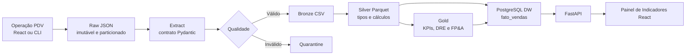

# Arquitetura e Operação da Plataforma RetailCo FP&A

## Objetivo

A plataforma RetailCo FP&A recebe fechamentos de vendas de cinco lojas, preserva
os documentos originais em um Data Lake local, executa tratamento financeiro e
publica indicadores gerenciais em um Data Warehouse PostgreSQL. O sistema inclui:

- Simulador operacional de PDV.
- Pipeline ETL diário e backfill mensal.
- Orquestração Apache Airflow.
- Data Warehouse dimensional e views analíticas.
- API FastAPI para consumo dos dados.
- Painel React para FP&A e operação do PDV.

## Componentes

| Componente | Tecnologia | Responsabilidade | Acesso local |
| --- | --- | --- | --- |
| `frontend` | React + Vite | Painel FP&A e terminal PDV | `http://localhost:5173` |
| `api` | FastAPI | Métricas e operações do PDV | `http://localhost:8000` |
| `airflow-webserver` | Apache Airflow 2.8 | Monitoramento e disparo das DAGs | `http://localhost:${AIRFLOW_WEBSERVER_PORT}` |
| `airflow-scheduler` | Apache Airflow 2.8 | Execução agendada do ETL | Interno |
| `postgres_dw` | PostgreSQL 15 | Warehouse analítico | `localhost:5432` |
| `postgres_airflow` | PostgreSQL 15 | Metadados do Airflow | `localhost:5433` |

## Fluxo End-to-End



## Estrutura do Código

| Diretório | Conteúdo |
| --- | --- |
| `api/` | Aplicação FastAPI, repositório analítico e rotas PDV |
| `app_vendas/` | Serviço de geração de turno e persistência Raw |
| `config/` | Configuração por ambiente, lojas, produtos e orçamento |
| `dags/` | DAG diária `etl_vendas_fpa` e utilitários Airflow |
| `database/` | Esquema dimensional, seeds, views, consultas e migrações |
| `frontend/` | Aplicação React com dashboard e página `/pdv` |
| `scripts/` | ETL, qualidade, carga, backfill, KPIs, DRE e FP&A |
| `dashboards/` | Modelo e medidas para Power BI |
| `notebooks/` | Análises exploratórias e validações |
| `tests/` | Testes unitários e integração |

## Inicialização

### Com Docker Compose

1. Crie as variáveis locais:

```bash
cp .env.example .env
```

2. Construa e inicie os serviços:

```bash
docker compose --env-file .env up -d --build
```

3. Confira a saúde dos containers:

```bash
docker compose --env-file .env ps
```

4. Acesse:

| Recurso | URL |
| --- | --- |
| Painel FP&A | `http://localhost:5173` |
| Operação PDV | `http://localhost:5173/pdv` |
| Evolução de lojas | `http://localhost:5173/evolucao` |
| Documentação Swagger | `http://localhost:8000/docs` |
| Airflow | `http://localhost:8080` por padrão |

### Variáveis Relevantes

| Variável | Finalidade | Padrão de exemplo |
| --- | --- | --- |
| `POSTGRES_DB` | Banco do warehouse | `retail_dw` |
| `POSTGRES_USER` | Usuário do warehouse | `retail_user` |
| `AIRFLOW_WEBSERVER_PORT` | Porta web do Airflow no host | `8080` |
| `DATA_LAKE_BASE_PATH` | Raiz das camadas de arquivos | `/opt/airflow/retail/data` |
| `PIPELINE_VERSION` | Versão registrada na rastreabilidade | `1.0.0` |
| `TAXA_IMPOSTO` | Taxa usada na DRE | `0.12` |
| `TAXA_DESPESA_VARIAVEL` | Despesa variável aplicada | `0.06` |
| `BUDGET_ANNUAL_GROWTH` | Crescimento anual do orçamento futuro | `0.05` |

## Data Lake

### Camadas

| Camada | Formato | Função |
| --- | --- | --- |
| Raw | JSON | Fonte original do PDV com checksum, preservada sem sobrescrita |
| Bronze | CSV | Linhas achatadas com metadados de origem |
| Silver | Parquet | Dados tipados e valores financeiros calculados |
| Gold | CSV | Indicadores mensais, DRE e FP&A |
| Quarantine | CSV | Arquivos ou registros recusados com justificativa |

### Particionamento Raw

Um fechamento de turno é armazenado em:

```text
data/raw/vendas/loja=loja_{id}/ano=YYYY/mes=MM/dia=DD/
  vendas_{id}_YYYYMMDD_{turno}.json
```

Exemplo:

```text
data/raw/vendas/loja=loja_1/ano=2026/mes=05/dia=25/
  vendas_1_20260525_manha.json
```

Regras:

- Existe no máximo um arquivo por loja, data e turno.
- Um arquivo Raw existente não é sobrescrito por padrão.
- Cada documento contém `pipeline_id`, quantidade de registros e checksum SHA-256.
- Correções controladas por CLI exigem `--overwrite`.

## Pipeline ETL

### Etapas

| Etapa | Módulo | Resultado |
| --- | --- | --- |
| Geração | `scripts.generate_sales_data` ou PDV | JSONs na Raw |
| Extração | `scripts.extract` | Bronze CSV e isolamento de arquivo inválido |
| Validação | `scripts.validate` | Aprovados e quarentena |
| Transformação | `scripts.transform` | Silver Parquet, canceladas separadas |
| Carga | `scripts.load` | Fatos, dimensões, orçamentos e auditoria no DW |
| Indicadores | `scripts.kpis`, `scripts.dre`, `scripts.fpa` | Gold e fato DRE |

### Orquestração Airflow

A DAG `etl_vendas_fpa`:

- Executa diariamente às `06:00`.
- Verifica arquivos Raw para as cinco lojas.
- Segue pelo ramo `sem_dados` quando nenhuma origem estiver presente.
- Usa até três tentativas com espera exponencial.
- Mantém uma execução ativa por vez.
- Grava auditoria associada ao `run_id` real do Airflow.

O serviço `airflow-scheduler` permanece em segundo plano e avalia o agendamento
enquanto o container estiver ativo. O `airflow-webserver` publica a interface
de observabilidade e acionamento em `http://localhost:8080` por padrão. Se
essa porta já pertencer a outro serviço, defina `AIRFLOW_WEBSERVER_PORT=8081`
no `.env` antes de iniciar os containers.

### Acionamento Manual Pelo Airflow

Pela interface web:

1. Acesse a porta configurada em `AIRFLOW_WEBSERVER_PORT`, por padrão
   `http://localhost:8080`.
2. Abra a DAG `etl_vendas_fpa`.
3. Remova a pausa da DAG, caso necessário.
4. Use `Trigger DAG` e informe a data lógica que possui arquivos Raw.
5. Acompanhe extração, validação, transformação, carga e Gold na visualização da execução.

Pela linha de comando:

```bash
make trigger-airflow REFERENCE_DATE=2026-05-25
```

Comando expandido:

```bash
docker compose exec airflow-scheduler airflow dags unpause etl_vendas_fpa
docker compose exec airflow-scheduler airflow dags trigger -e 2026-05-25 etl_vendas_fpa
```

Notas operacionais:

- A data passada em `-e` é utilizada pela DAG como `{{ ds }}` para localizar a partição Raw.
- Uma DAG pausada aceita o disparo, porém a execução permanecerá enfileirada; por isso o
  comando acima executa `unpause` primeiro.
- Um disparo sem origem Raw segue com sucesso pelo ramo `sem_dados`.
- A carga é idempotente: reexecutar a data não duplica a chave `(id_venda, loja_id)`.

### Processamento Imediato Pelo PDV

O botão `Processar data no DW` na página `/pdv` não cria um DagRun. Ele
executa o pipeline diretamente pela API FastAPI para que o operador veja o
resultado imediatamente e registra a carga com um `run_id` iniciado por
`pdv_api_`.

| Necessidade | Caminho indicado |
| --- | --- |
| Fechar um caixa e atualizar o painel imediatamente | Botão no PDV |
| Inspecionar tarefas, novas tentativas e execução orquestrada | Acionamento manual do Airflow |
| Processar diariamente sem interação | Agenda diária às `06:00` |

### Processar Uma Data

```bash
python -m scripts.run_pipeline 2026-05-25
```

### Gerar e Carregar Uma Competência

Com Make:

```bash
make generate-month MONTH=2026-04
make load-month MONTH=2026-04
```

Ou diretamente no container:

```bash
docker compose --env-file .env exec -T airflow-scheduler \
  python -m scripts.generate_sales_data --month 2026-04

docker compose --env-file .env exec -T airflow-scheduler \
  python -m scripts.backfill --month 2026-04
```

Para qualquer mês futuro, substitua `2026-04` por `YYYY-MM`. Ao receber
uma competência de novo ano, a carga insere as datas necessárias em
`dim_tempo` e provisiona os doze orçamentos mensais daquele ano aplicando
`BUDGET_ANNUAL_GROWTH`.

## Data Warehouse

### Modelo Dimensional

| Tabela | Tipo | Descrição |
| --- | --- | --- |
| `dim_loja` | Dimensão | Cadastro das lojas |
| `dim_produto` | Dimensão | Cadastro de produtos |
| `dim_cliente` | Dimensão | Clientes observados no PDV; chave de negócio `BIGINT` |
| `dim_tempo` | Dimensão | Calendário diário |
| `fato_vendas` | Fato | Uma linha por item vendido |
| `fato_orcamento` | Fato | Orçamento mensal por loja |
| `fato_dre` | Fato | Resultado financeiro por loja/mês |
| `processed_files` | Controle | Checksums e reprocessamento de arquivos |
| `pipeline_audit_log` | Controle | Execuções, volumes e status |

O fato de vendas é idempotente pela chave:

```text
(id_venda, loja_id)
```

### Migração de Cliente

Ambientes iniciados com a versão anterior do esquema devem promover
`cliente_id` para `BIGINT` antes de receber dados de períodos posteriores.

PowerShell:

```powershell
Get-Content database\migrations\002_expand_customer_business_key.sql |
  docker compose --env-file .env exec -T postgres_dw psql -U retail_user -d retail_dw
```

Bash:

```bash
docker compose --env-file .env exec -T postgres_dw psql \
  -U retail_user -d retail_dw \
  < database/migrations/002_expand_customer_business_key.sql
```

Instâncias com rótulos cadastrados sem acentuação podem ser normalizadas sem
alterar chaves ou medidas financeiras:

```powershell
Get-Content database\migrations\003_normalize_portuguese_labels.sql |
  docker compose --env-file .env exec -T postgres_dw psql -U retail_user -d retail_dw
```

### Consultas Operacionais

```sql
SELECT ano, mes, COUNT(*) AS fatos
FROM fato_vendas
GROUP BY ano, mes
ORDER BY ano, mes;

SELECT status, COUNT(*)
FROM fato_vendas
WHERE ano = 2026 AND mes = 5
GROUP BY status;

SELECT *
FROM pipeline_audit_log
ORDER BY created_at DESC
LIMIT 20;
```

## Painel React

### Painel de Indicadores

Rota: `http://localhost:5173`

O painel lê exclusivamente a API conectada ao DW e atualiza a consulta
automaticamente a cada 15 segundos. A tela apresenta:

- Receita líquida e receita bruta.
- EBITDA e margem EBITDA.
- Ticket médio.
- Margem bruta.
- Vendas pendentes e canceladas.
- Evolução mensal.
- Ranking de lojas.
- Top produtos.
- FP&A por unidade.
- Métricas de processamento e canais.

### Terminal PDV

Rota: `http://localhost:5173/pdv`

O terminal permite:

1. Selecionar loja, data e turno.
2. Definir o volume de vendas simuladas, de `1` a `150`.
3. Emitir um fechamento Raw imutável.
4. Emitir o fechamento geral da data para todas as lojas e turnos, com carga imediata no DW.
5. Consultar recibo, totais e movimento do turno ou arquivos do dia.
6. Executar imediatamente o processamento da data no DW.

Os turnos `MANHA`, `TARDE` e `NOITE` possuem faixas próprias para os IDs
das vendas e dos clientes, permitindo múltiplos fechamentos no mesmo dia
sem colisão entre arquivos operacionais.

No fechamento geral, a API cria quinze documentos Raw, um por combinação de
loja e turno. A emissão é bloqueada antes da gravação quando qualquer documento
da data já estiver presente, mantendo o conjunto diário consistente. Após emitir
com sucesso, o mesmo endpoint executa o pipeline até o DW, disponibilizando a
competência nas telas analíticas sem um segundo acionamento.

### Evolução de Lojas

Rota: `http://localhost:5173/evolucao`

A página consome `GET /api/evolution` e permite analisar séries mensais reais:

- Gráfico de linha comparativo das cinco lojas.
- Seleção de receita, ticket médio, margem bruta, meta atingida e participação na receita.
- Gráfico focal da receita da loja escolhida.
- Gráfico de EBITDA consolidado da rede.
- Cards com variação mensal, forecast, meta e taxa de cancelamento.

### Ajuste de Forecast

Rota: `http://localhost:5173/forecast`

A página consome `GET /api/forecast` para apoiar revisões periódicas do cenário:

- Horizonte selecionável de 3, 6, 9 ou 12 competências futuras.
- Ajuste gerencial percentual aplicado sobre a previsão base.
- Linha de receita realizada, forecast base e forecast ajustado para a rede.
- Trajetória prevista por loja e detalhamento mensal contra orçamento.
- EBITDA estimado a partir da margem EBITDA recente disponível.

A previsão parte do forecast de fechamento da última competência observada e aplica a
tendência recente de receita por loja, com limite de `-15%` a `15%` ao mês para reduzir
distorções. Meses sem orçamento provisionado são projetados, mas não geram desvio de meta.

## Monitoramento e Auditoria

| Evidência | Local |
| --- | --- |
| Execução agendada | Interface Airflow |
| Auditoria de carga | `pipeline_audit_log` |
| Controle de arquivo | `processed_files` |
| Erros de qualidade | `data/quarantine/` |
| Logs estruturados | `data/logs/` |
| Saúde da API | `GET /api/health` |

## Qualidade e Testes

### Backend

```bash
python -m black config scripts dags app_vendas api tests
python -m ruff check config scripts dags app_vendas api tests
python -m mypy config scripts app_vendas api
python -m pytest -q
```

### Frontend

```bash
cd frontend
npm install
npm run lint
npm run build
```

Os testes incluem:

- Regras de qualidade de vendas.
- Fórmulas e transformações.
- Geração mensal e imutabilidade Raw.
- Separação de identidades entre turnos do PDV.
- Fluxo Raw até Gold.
- Idempotência da carga no PostgreSQL quando configurada.

## Referências Complementares

- [Diagramas de Fluxo](DIAGRAMA_FLUXO.md)
- [Referência REST da API](API_REFERENCE.md)
- [Manual do Operador PDV](GUIA_PDV.md)
- [Modelo Power BI](../dashboards/powerbi_model.md)
- [Métricas do Painel](../dashboards/metricas_dashboard.md)
