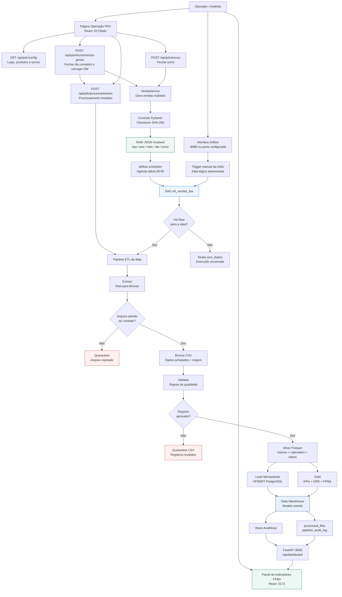
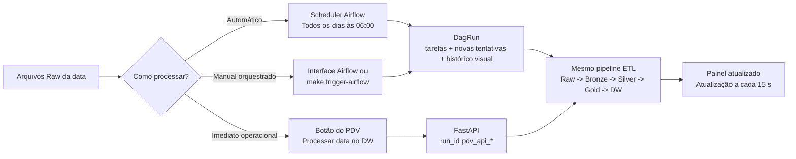
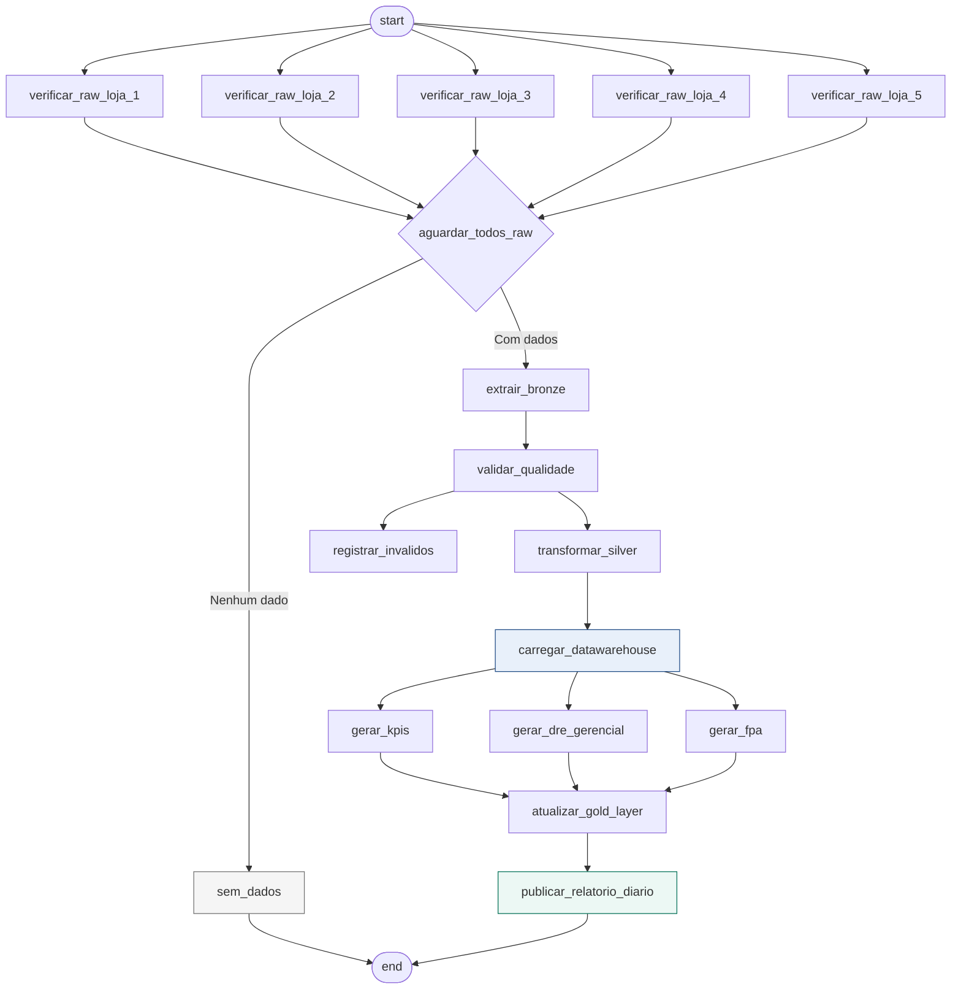
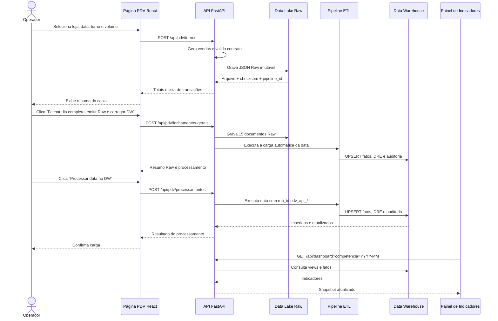

# Diagrama de Fluxo - Retail Data Lake FP&A

## Fluxo Geral da Plataforma

## Caminhos de Execução

## Fluxo da DAG Airflow

## Fluxo do Operador PDV

## Decisões Importantes

| Decisão | Efeito no Fluxo |
| --- | --- |
| Raw imutável | Um mesmo fechamento loja/data/turno não é substituído acidentalmente |
| IDs separados por turno | `MANHA`, `TARDE` e `NOITE` podem coexistir na mesma data |
| UPSERT no fato | Reprocessar uma data não duplica vendas |
| `run_id` auditável | É possível distinguir execução Airflow e processamento iniciado no PDV |
| Duas formas de execução | Operação imediata via PDV ou orquestração completa via Airflow |
